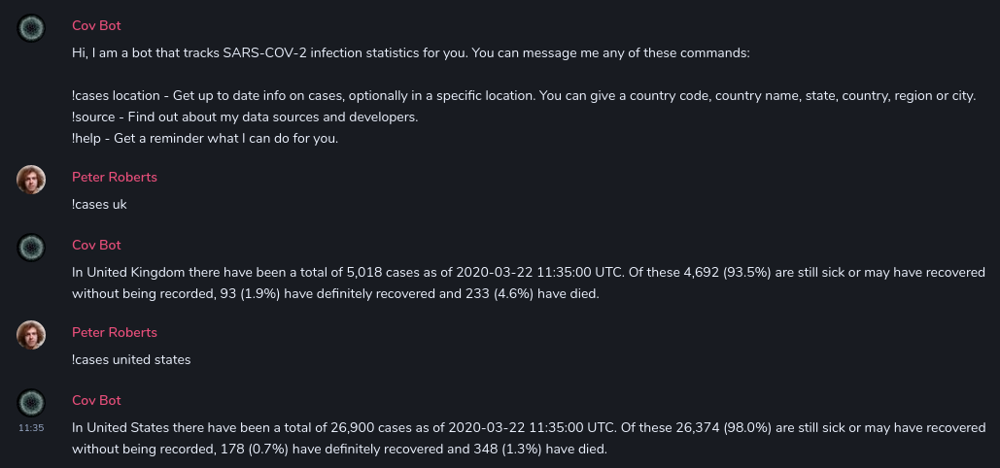

# covbot

Matrix bot tracking SARS-COV-2 statistics using data from https://offloop.net/covid19/ and [maubot](https://maubot.xyz). Inspired by [BrainstormBot](https://twitter.com/BrainstormBot).

- Chat with me on Matrix as [@covbot:shortestpath.dev](https://matrix.to/#/@covbot:shortestpath.dev).
- Chat with me on Freenode as CovBot ([##covid-19](https://kiwiirc.com/client/irc.freenode.net/##covid-19) is a great channel!).
- Chat with me on WhatsApp at [+447421002069](https://wa.me/447421002069).
- Chat with me on Telegram as [@TheCovBot](https://t.me/TheCovBot).

## Usage

Message CovBot and it'll say hello and let you know how to use it. If you want a reminder at any point then just message `!help`.

## Contributing

Pull requests are welcome and if you don't have any ideas what to work on then check the [issues](https://github.com/pwr22/covbot/issues) for something to pick up. Feel free to drop into [#covbot:shortestpath.dev](https://matrix.to/#/!awMILboqesCENShaME:shortestpath.dev?via=shortestpath.dev&via=matrix.org&via=thomcat.rocks) to discuss.

## Self-Hosting

To run your own instance, download the latest release and upload to your [maubot](https://maubot.xyz).
